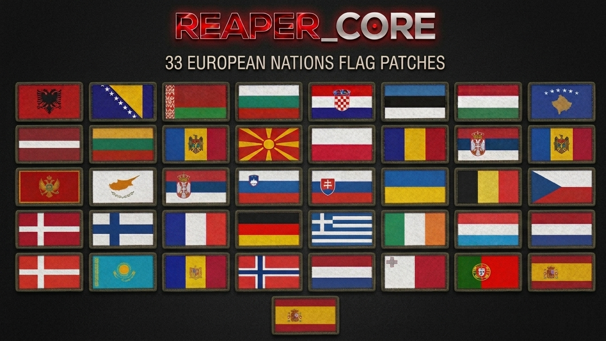
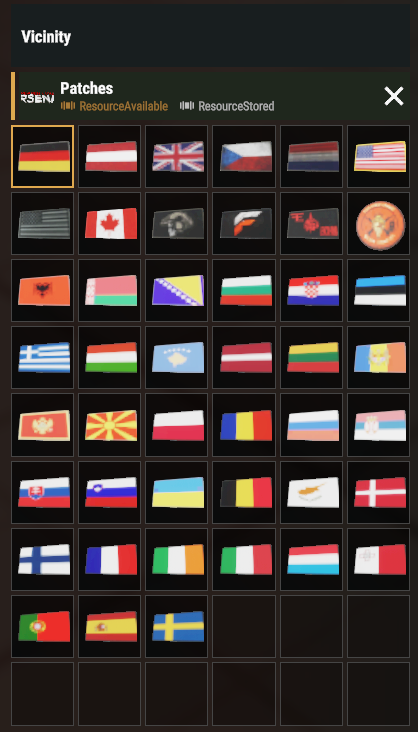

# PT Reaper Addons

33 country flag patches for [REAPER_CORE](https://reforger.armaplatform.com/workshop/5EB139459EBF5C16) in Arma Reforger. The patches use its rectangular patch system and appear in its arsenal. Eastern European, Baltic, and Balkan flags are listed first, followed by additional EU flags.



[Get PT Reaper Addons on the Arma Reforger Workshop](https://reforger.armaplatform.com/workshop/4CA7EDED31724660-PTReaperAddons)

## Screenshot



## How it works

1. Each country starts as an SVG in [`Assets/Flags`](Assets/Flags). [`build-country-patches.cjs`](Tools/build-country-patches.cjs) places it on a stitched patch texture; `sharp` prepares the image and `texconv` encodes the game texture (`.edds`).
2. The generated material (`.emat`) points to that texture. Each prefab (`.et`) inherits REAPER_CORE's rectangular patch and overrides its material for both the inventory item and the worn patch. The mesh and shared maps remain in REAPER_CORE.
3. [`PT_ReaperPatchArsenal.c`](Scripts/Game/PT_ReaperPatchArsenal.c) extends the existing arsenal method. It calls `super`, then adds our prefabs only when REAPER_CORE is loading its patch catalog; other catalogs are untouched.
4. The `.meta` files give resources stable IDs. Keep them when regenerating assets so prefab and material references do not break.

## Build

Install Node.js 20.9+ and Microsoft's `texconv.exe`, then run:

```sh
npm ci
npm run build -- "C:\path\to\texconv.exe"
npm run verify
```

Generated resources are committed, so you only need the build tools when changing flags. `npm run verify` checks resource references and catalog entries; use Workbench to compile scripts and inspect the patch, then test equipping in-game.

## Credits and license

Created by eduvhc under the [MIT license](LICENSE). Flag source artwork is from [flag-icons](https://github.com/lipis/flag-icons) under its [MIT notice](LICENSES/flag-icons-MIT.txt). REAPER_CORE is by r34p3r and must be installed separately; its assets are not included or relicensed here.
